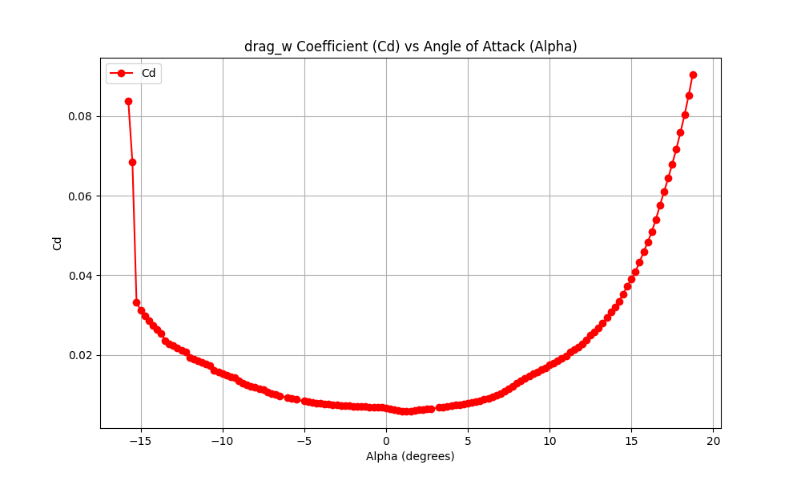

# Personal Drone Calculations and Notes

## Drone Design

### Main Wing Body

- `b` = 2.5ft = .762m
- `c_bar` = 4in = .1016m
- `S` = .0774 m^2

**Airfoil**: NACA 4412 - plots at Re = 1e6

## Dev Env Activation

`source env/bin/activate` - use local env

`deactivate` - use global env# fixed-wing-drone-design
