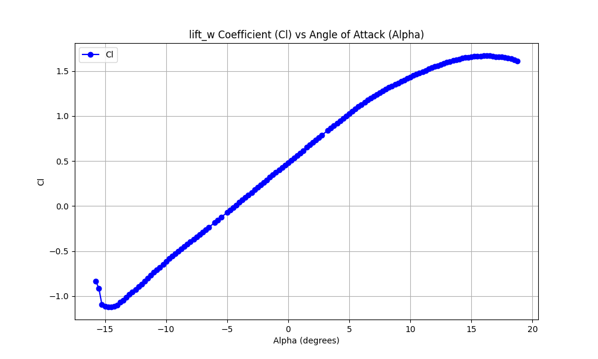

# Personal Drone Calculations and Notes

## Drone Design

### Main Wing Body

- `b` = 2.5ft = .762m
- `c_bar` = 4in = .1016m
- `S` = .0774 m^2

**Airfoil**: NACA 4412 - plots at Re = 1e6

**Wing Body L/D vs Trim Alpha at 10m/s**

## Dev Env Activation

`source env/bin/activate` - use local env

`deactivate` - use global env# fixed-wing-drone-design

## Process

Collecting my design process into one place

1. Pick wing body airfoil (NACA 4412)
2. Pick wing body aspect ratio (7.5)
3. Pick wing body chord length (`c_bar` = .1016m) (limited by 3d printer size and practical assembly restraints)
4. Calculate `b`, `S` from the two above values
5. Calculate L, D, L/D for V=[1,20] and trim_alpha=[-5,5.5]
6. Choose optimal trim_alpha from above calculations
7. Calculate Lift at trim from main wing body
8. Pick Tail airfoil (NACA 4412)
9. Pick Tail chord length/span length
10. Calculate lift from tail at trim - i_t